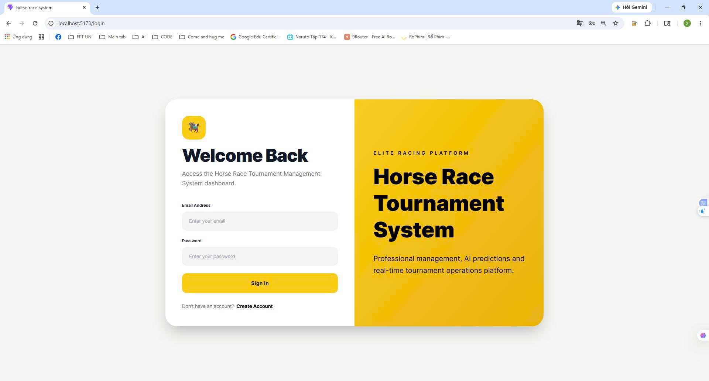
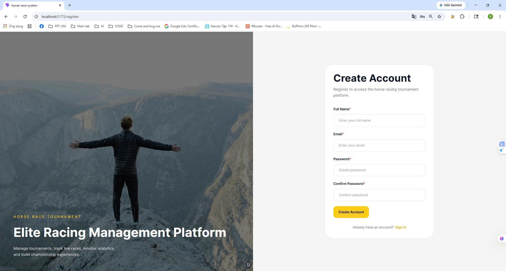
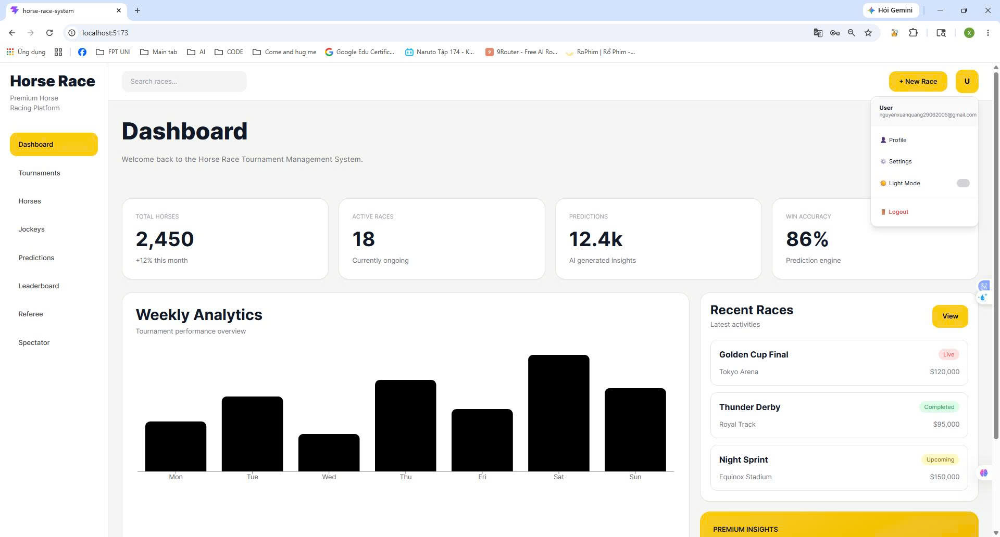
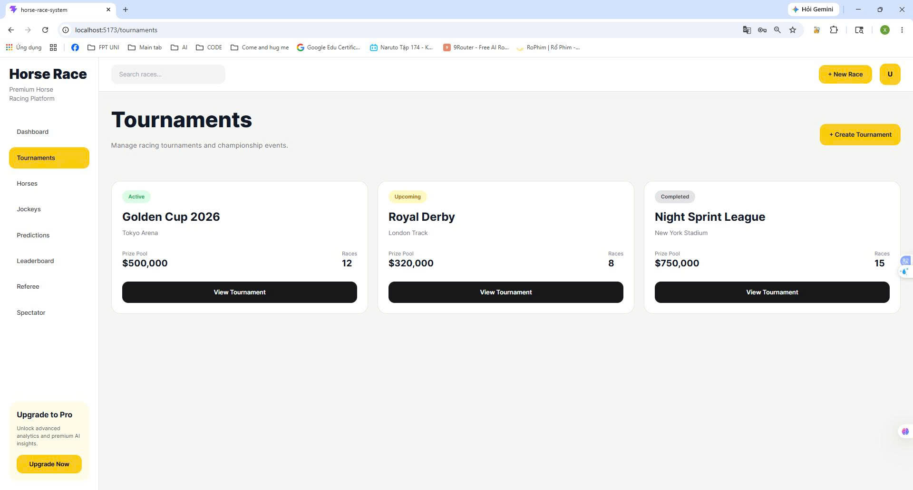
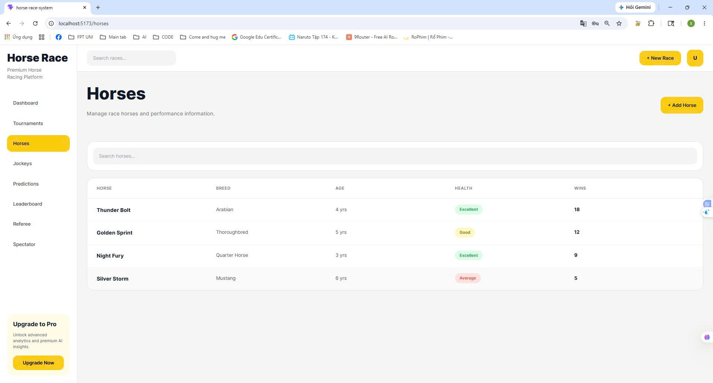
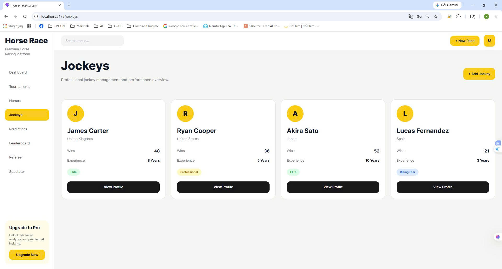
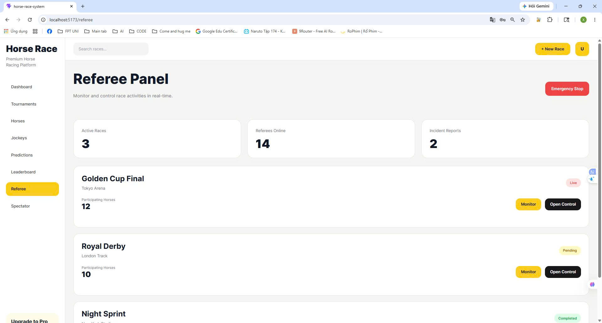
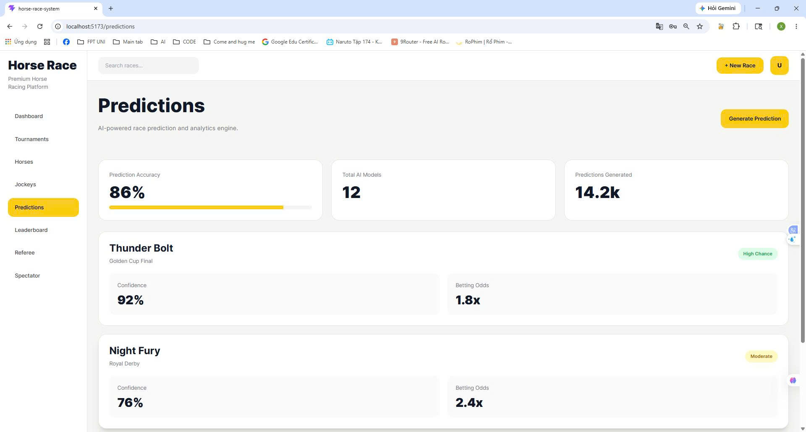
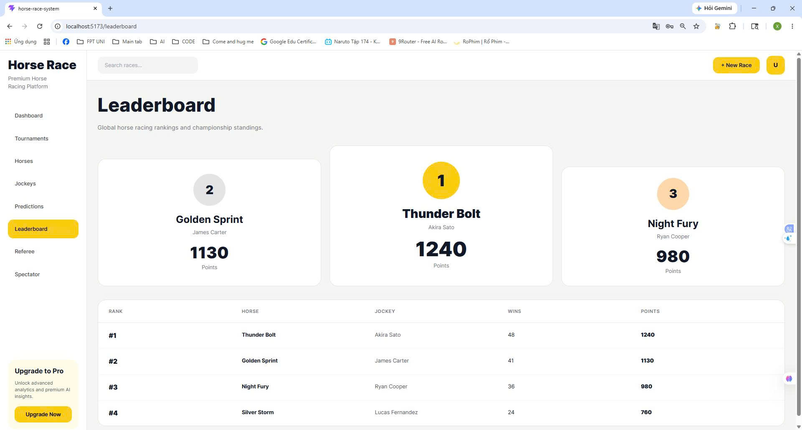
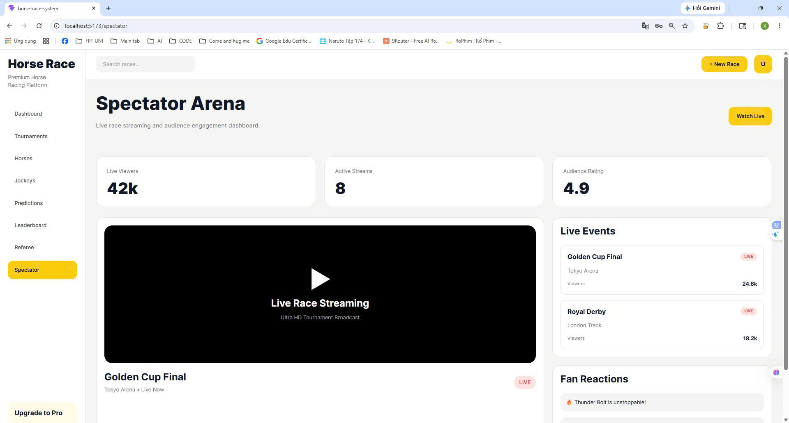

# 🏇 Horses Race - Horse Race Tournament Management System

Horse Race is a modern web-based platform designed to manage and organize horse racing tournaments efficiently.
The system provides comprehensive tools for tournament administration, horse and jockey management, race scheduling, predictions, rankings, and spectator interaction.

This project was developed as part of the SWP391 course project.

---

# 📌 Front-End Overview

The Front-End of Horse Race Web is developed using ReactJS and Vite to provide a modern, responsive, and interactive user experience for the Horse Race Tournament Management System.

The application is designed to support core functionalities such as authentication, tournament management, horse and jockey management, prediction systems, leaderboards, and spectator interaction.
With a component-based architecture, the system ensures maintainability, scalability, and efficient UI development.

TailwindCSS is used to create a clean and professional dashboard interface, while Axios handles seamless communication with the ASP.NET Core Web API backend.
The Front-End focuses on delivering smooth navigation, responsive layouts, and an intuitive workflow to improve overall user experience and system usability.

# 🚀 Features

## 🔐 Authentication & Authorization

* Secure JWT Authentication
* User Login & Registration
* Role-based Access Control

## 🏆 Tournament Management

* Create and manage tournaments
* Organize race schedules
* Track tournament progress and status

## 🐎 Horse Management

* Add, update, and manage horse information
* Track horse statistics and performance

## 🧑‍✈️ Jockey Management

* Manage jockey profiles
* Assign jockeys to races and horses
* Performance tracking system

## 👨‍⚖️ Referee Management

* Referee assignment system
* Race supervision management

## 🎯 Prediction System

* Race outcome prediction
* Prediction ranking system
* Win probability visualization

## 🏅 Leaderboard System

* Dynamic ranking updates
* Tournament standings
* Score tracking

## 👥 Spectator Features

* View race schedules
* Follow tournament results
* Watch leaderboard updates

---

# 🛠️ Tech Stack

## Front-End

* ReactJS
* Vite
* TailwindCSS
* Axios
* React Router DOM

## Back-End

* ASP.NET Core Web API
* Entity Framework Core
* JWT Authentication

## Database

* SQL Server

## Development Tools

* Git & GitHub
* Postman
* Visual Studio

---

# 🏗️ Architecture

The system follows the **3-Layer Architecture**:

* Presentation Layer (FE)
* Business Logic Layer (BE)
* Data Access Layer

---

# 📂 Project Structure

```bash
src/
├── assets/
├── components/
├── layouts/
├── pages/
├── routes/
├── services/
├── utils/
└── App.jsx
```

---

# 📷 Screenshots

## 🔐 Login Page



---

## 📝 Register Page



---

## 📊 Dashboard



---

## 🏆 Tournament Management



---

## 🐎 Horse Management



---

## 🧑‍✈️ Jockey Management



---

## 👨‍⚖️ Referee Management



---

## 🎯 Prediction System



---

## 🏅 Leaderboard



---

## 👥 Spectator Interface



